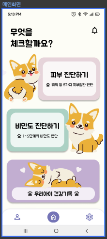

# 🐾 [경진대회 대상 수상작] PetDoctor
### (Android)Flutter로 개발한 반려동물 피부질환/비만도 진단 어플

---

## 📑 프로젝트 개요
- **프로젝트 설명**: 
  - 캡스톤디자인 과목에서 학기작으로 개발한 프로젝트
  - 교내 캡스톤디자인 과목을 수강하는 모든 학생을 대상으로 하는 캡스톤디자인경진대회 출품작
- **역할**: 
  - PM으로서 일정 관리 및 최종 PPT 제작, 최종 발표 진행
  - 기획 30%, 디자인 100%, 프론트엔드 100% 개발
- **팀 구성**: 총 3명 (디자인/Android 1명, 백엔드 1명, AI 1명)

---

## 🛠️ 역할 및 기여
1. **🎨 UI 디자인**
   - 20대 여성 사용자를 타겟으로 감성적이고 직관적인 UI 디자인
   - Figma로 디자인 작업 혼자서 100% 진행
     &nbsp;&nbsp;[👉 피그마 디자인 바로가기](https://www.figma.com/design/3AAVLJigfm1lqYiol0oYUg/Prototype?node-id=0-1&t=3AJcZEEdbC8ajIM0-1)

   

2. **🔍 AI 피부질환/비만도 진단 기능 및 UX를 고려한 문제해결**
   - 사진 촬영, 전송 후 AI 서버에서 피부질환 진단 또는 비만도 분석 결과를 받아와 화면에 표시
   - **GetX 플러그인**을 활용해 UI의 매끄러운 전환을 고려한 버튼 상태관리
   - 최종 확인 버튼을 눌러야 화면 전환이 되도록 설계하여, 클릭 오류 방지 및 사용성 개선
   - **AI 서버로의 이미지 전송 시간 및 AI 모델의 처리 시간이 누적되어 전체 응답 시간이 지연되는 문제 발생**
     - 사진 하나를 촬영할때마다 업로드해 다음 사진을 촬영하는 동안 업로드가 완료될 수 있도록 구현
       ➡️ AI 진단 결과 수신을 기존 **10초에서 7~8초**정도로 줄임
     - AI로 세부 진단을 하기 때문에 시간 소요가 있다는 사실을 유저가 직관적으로 이해할 수 있도록 진단 시 AI 진단 애니메이션 삽입

   
   
   

3. **📊 그래프로 진단 데이터 시각화**
   - **Flutter Charts 플러그인**을 사용하여 반려동물의 질병 기록 변화와 비만도 변화를 그래프로 시각화
   - 각 진단 기록 클릭 시 질병 및 비만도 진단 기록과 촬영했던 사진 제공
   - 캐싱 및 타임스탬프를 활용한 데이터 로딩 최적화로 UI/UX 개선

   

4. **🔐 보안 및 로그인**
   - **Firebase Authentication**을 사용해 소셜 로그인 기능 구현
   - **flutter_secure_storage**를 사용해 보안을 고려하며 액세스 토큰 관리

---

## 🏆 프로젝트 성과
- **Linc사업단 주최 캡스톤디자인 경진대회에서 대상 수상**
- **캡스톤디자인 과목 성적 A+**
- **구글 플레이 스토어에 업로드 완료 및 내부 테스트 승인 상태**

---

## 🧰 사용 기술
| **기술**              | **설명**                           |
|----------------------|-----------------------------------|
| 💻 **Flutter**        | 안드로이드 개발          |
| 🎨 **Figma**          | UI 디자인 및 피드백               |
| 🔥 **Firebase**       | 구글 로그인 및 인증                 |

---

## 📂 관련 자료

- [📄 발표자료](./petdoctorfinal.pdf)
- [📱 APK 다운로드](./petdoctorAPK.zip)
- [📋 Notion - 프로젝트 상세 페이지](https://moongbyeol.notion.site/Android-c0306505477045f58cd6bc1de413c44b)

---

## 📈 프로젝트 의의

기술뿐만 아니라 UX적 측면을 고민하며 개발했습니다. 전체 프론트엔드 및 디자인 작업을 혼자 처음부터 끝까지 진행하면서, User Experience를 고려하는 개발자로서 크게 성장할 수 있었습니다. 디자이너로서, 기획자로서, 그리고 소프트웨어 엔지니어로서의 경험이 유저 만족도를 높이는 개발자가 되는 데에 기여할 수 있을 것이라 생각합니다. 팀장으로서, 개발자로서 모두 많이 성장했던 프로젝트인 것 같고, 3개월동안 함께 몰입해서 세 명이서 만들어낼 수 있는 최대한의 결과물을 뽑아냈다고 생각합니다.

---

